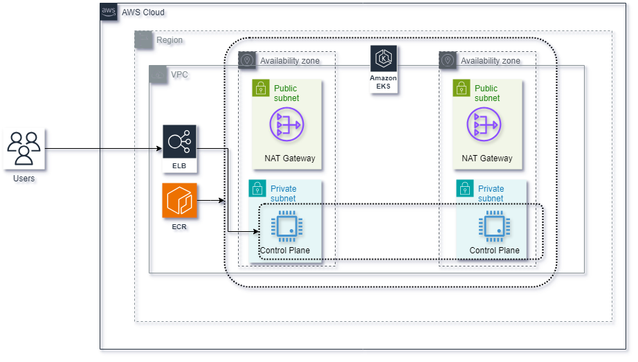
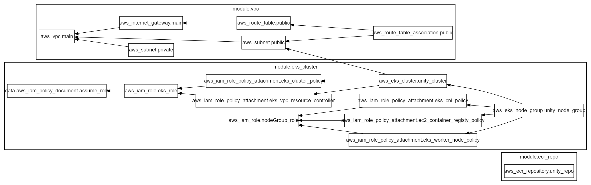
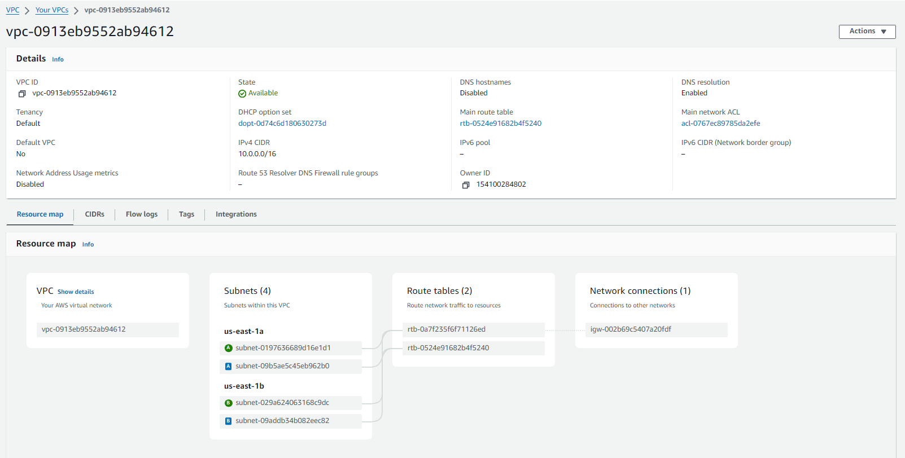
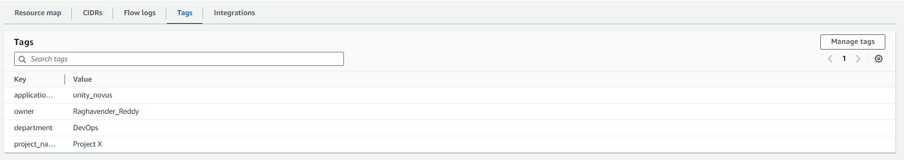
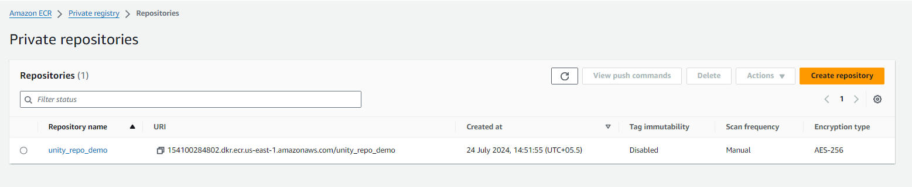
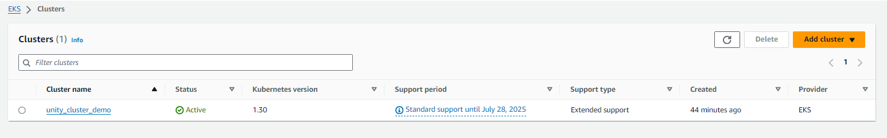
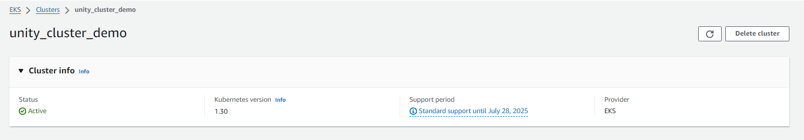
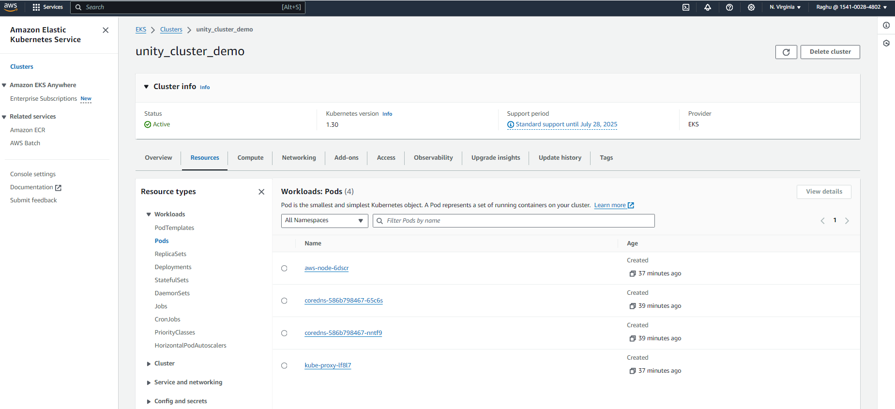
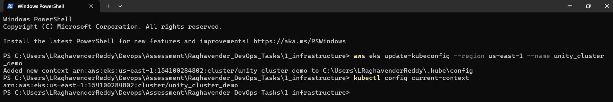
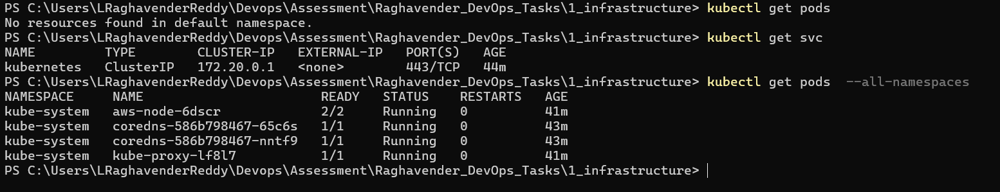

# Infrastructure Test

I had created `EKS Cluster` as it provides a robust, scalable, and secure platform for deploying microservices in a repeatable manner. By leveraging Kubernetes' orchestration capabilities and AWS’s managed services, we can streamline our deployment processes, improve resource utilization, and ensure high availability and security for our applications.




I had used `Terraform` for creating Infrastructure, because of its Automated Provisioning, Modularity and Reusability.

## Terrraform Graph



## VPC

When we are creating a EKS, we need VPC for following reasons

- Network Isolation (allowing us to segment our EKS resources from other parts of our AWS infrastructure. This ensures that only authorized resources can communicate with the Kubernetes components.)
- VPCs allow you to use security groups and network ACLs to control inbound and outbound traffic to our EKS nodes and other components.
- Pod Networking



- Here I had created VPC along with required services like subnets, route tables and internet gateway.



- As a Best Practice, I had added tags for the resources that i had created.

## ECR



- ECR Repository to store the docker image of our applications.

## EKS



- EKS cluster to orchestrate our application in containers.





## Cluster Setup in local machine



- Accessing the Created Cluster in local machine.

```bash

aws eks update-kubeconfig --region us-east-1 --name unity_cluster_demo

kubectl config current-context

```



- Verifying the entities in the cluster through `kubectl` commands.

```bash

kubectl get pods

kubectl get svc

kubectl get pods --all-namespaces

```

- Now that we have our cluster up and running, we can start deploying our applications in it.


