# Automation Test

## Java Microservice Application

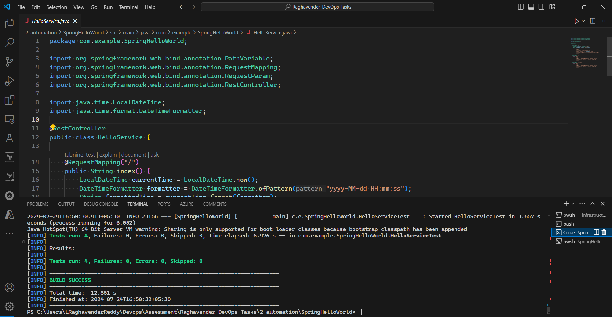

Pre-requisites for this Java application are

- Java
- Maven
- Springboot

We can run the application by following the commands

```java

mvn clean package
mvn test
mvn spring-boot:run 

```

## Dockerfile 

```Dockerfile
FROM openjdk:17-jdk-alpine

COPY target/*.jar ./app/unity_java.jar

ENTRYPOINT ["java","-jar","/app/unity_java.jar"]
```

> its present in this path `2_automation\Java-Unity-App\README.MD`

## Kubernetes configuration for the deployment

```yaml

apiVersion: apps/v1
kind: Deployment
metadata:
  name: unity-java
spec:
  selector:
    matchLabels:
      app: unity-java
  template:
    metadata:
      labels:
        app: unity-java
    spec:
      containers:
      - name: unity-java
        image: 154100284802.dkr.ecr.us-east-1.amazonaws.com/UNITY-IMAGE:TAG
        ports:
        - containerPort: 8080


```

## Kubernetes configuration for the service

```yaml

apiVersion: v1
kind: Service
metadata:
  name: unity-java-svc
spec:
  selector:
    app: unity-java
  type: LoadBalancer
  ports:
  - port: 8080
    targetPort: 8080

```

## Jenkins

### Pre-requisites

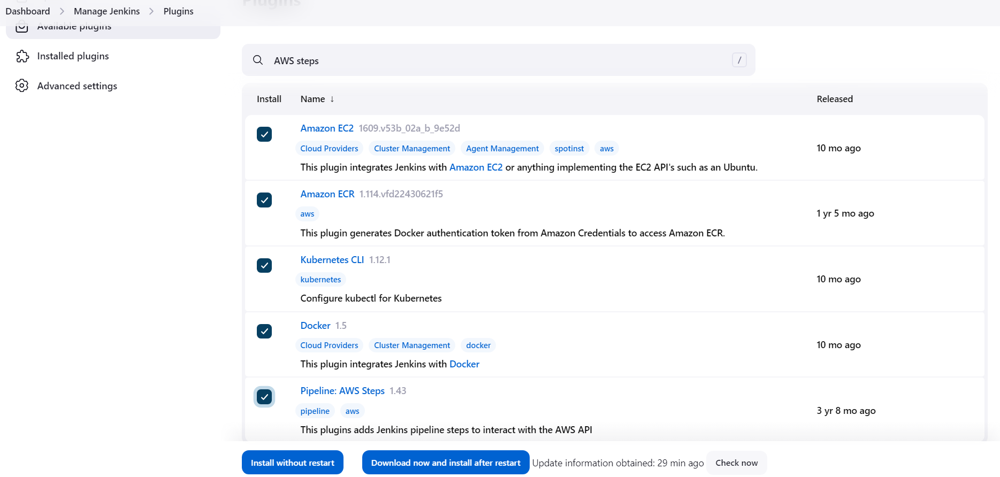

- Above are the some of plugins required for our automation workflow.

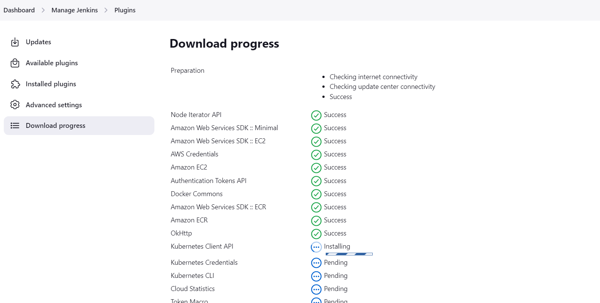

- Install these plugins.

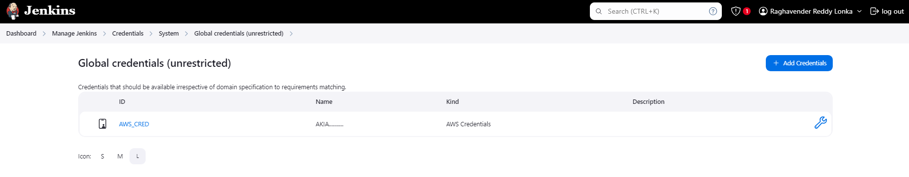

- Configure AWS Credentials in Jenkins.

- `Docker`, `AWS-CLI`, `Maven` and `Kubectl` should be installed on the `Build Executor`(Node).

- Below are some references to install the above mentioned tools.

https://docs.docker.com/engine/install/ubuntu/

https://kubernetes.io/docs/tasks/tools/install-kubectl-linux/

https://docs.aws.amazon.com/cli/latest/userguide/getting-started-install.html

https://maven.apache.org/download.cgi

https://www.digitalocean.com/community/tutorials/install-maven-linux-ubuntu

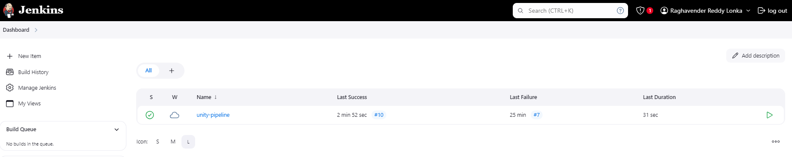

- Now Create the Pipeline Job.

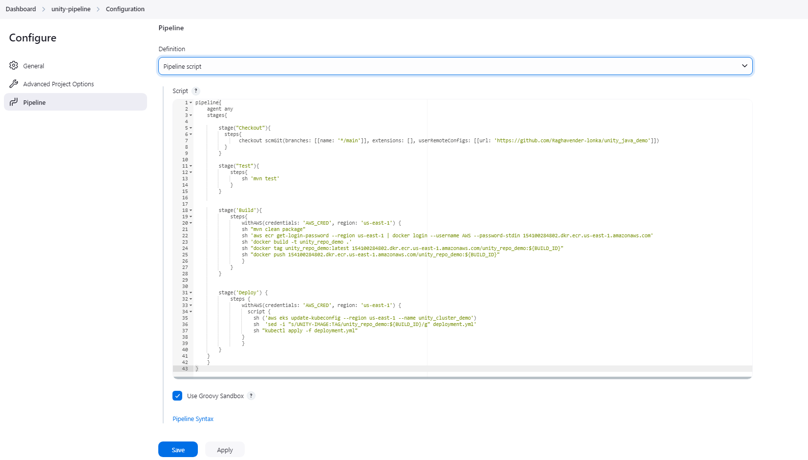

```groovy

pipeline{
    agent any
    stages{

        stage("Checkout"){
          steps{
               checkout scmGit(branches: [[name: '*/main']], extensions: [], userRemoteConfigs: [[url: 'https://github.com/Raghavender-lonka/unity_java_demo']])
          }
        }
        
        stage("Test"){
            steps{
                sh 'mvn test'
            }
        }
        

        stage("Build"){
            steps{
                withAWS(credentials: 'AWS_CRED', region: 'us-east-1') {
                sh 'mvn clean package'
                sh 'aws ecr get-login-password --region us-east-1 | docker login --username AWS --password-stdin 154100284802.dkr.ecr.us-east-1.amazonaws.com'
                sh 'docker build -t unity_repo_demo .'
                sh "docker tag unity_repo_demo:latest 154100284802.dkr.ecr.us-east-1.amazonaws.com/unity_repo_demo:${BUILD_ID}"
                sh "docker push 154100284802.dkr.ecr.us-east-1.amazonaws.com/unity_repo_demo:${BUILD_ID}"
                }
            }
        }
        
        
        stage("Deploy") {
            steps {
                withAWS(credentials: 'AWS_CRED', region: 'us-east-1') {
                  script {
                    sh ('aws eks update-kubeconfig --region us-east-1 --name unity_cluster_demo')
                    sh  'sed -i "s/UNITY-IMAGE:TAG/unity_repo_demo:${BUILD_ID}/g" deployment.yml'
                    sh 'kubectl apply -f deployment.yml'
                }
                }
        }
    }
    }
}

```

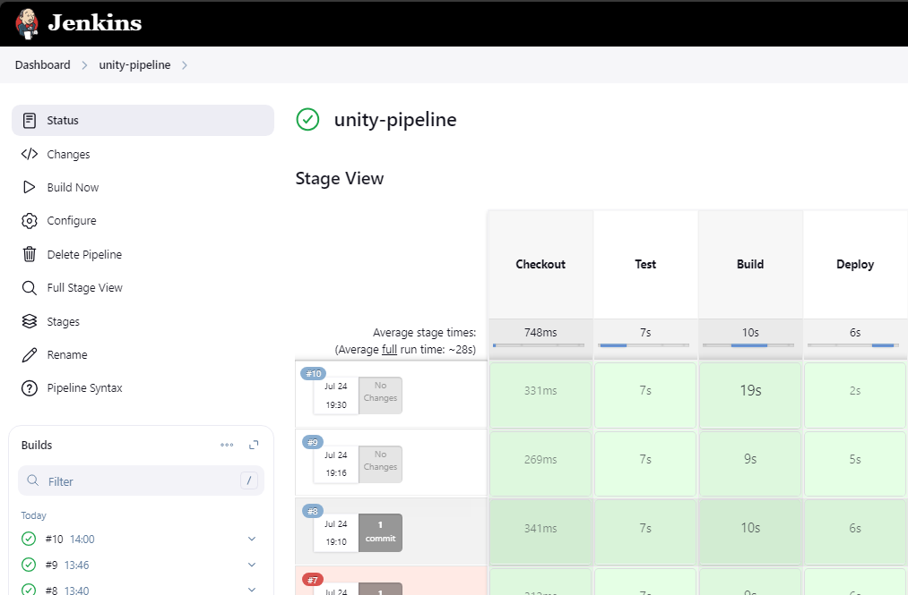

- Our Pipeline's Build Status.

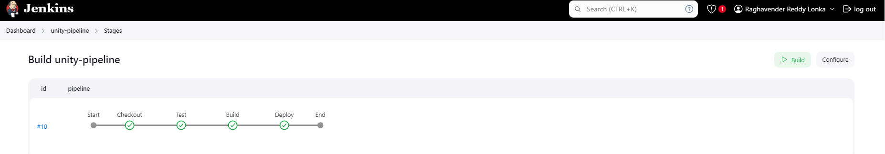

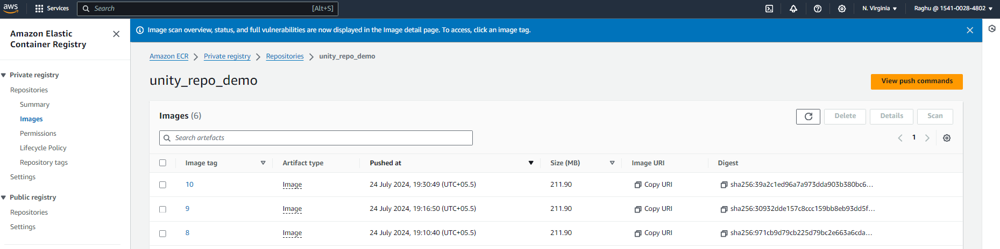

- We can see that the docker image had been built and pushed to the AWS ECR.

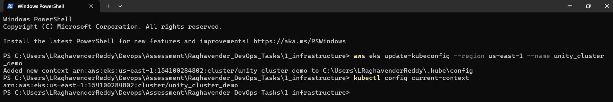

- Access to the AWS EKS Cluster in the local machine.

```bash
aws eks update-kubeconfig --region us-east-1 --name unity_cluster_demo

kubectl config current-context

```

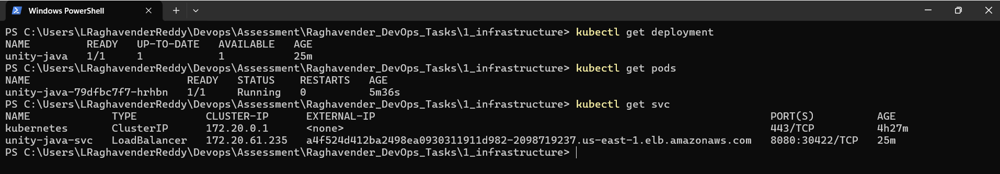

- Check the Deployment and Service Status through `kubectl` commands.

```bash

kubectl get deployments

kubectl get pods

kubectl get svc


```

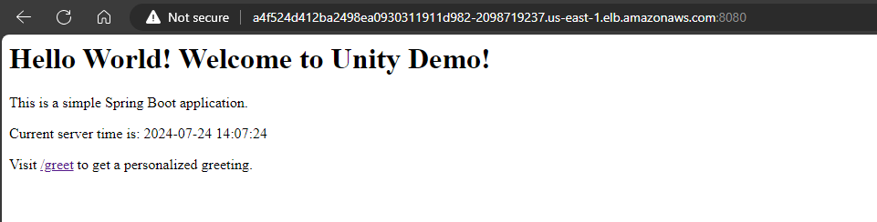

- By access the service endpoint, we can access to our applicaiton.

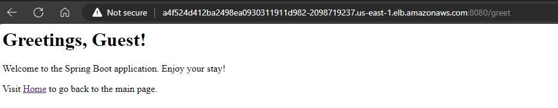

- We can see other route in our application also.

### Now our Automation Workflow is Completed and Our Application is up and running! 