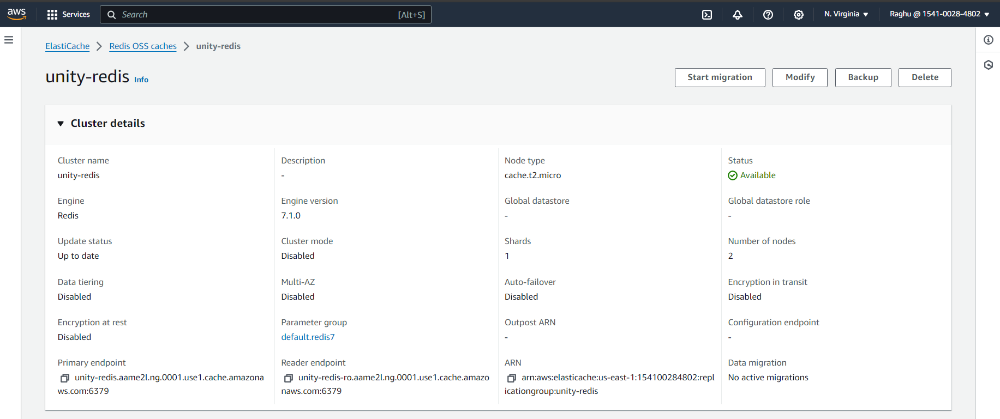
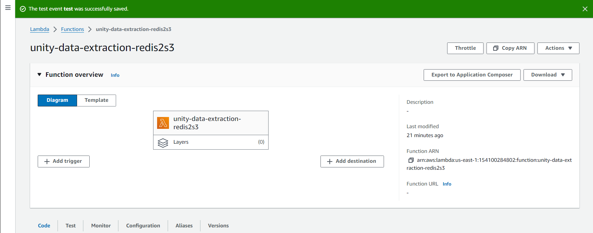

# Coding Test

## Redis




- Redis Cluster is up and running.


- Injecting some data into the cluster.

## Python Script

We need the following python modules for our data extraction script

- python-dotenv
- redis
- pandas
- boto3

```python

import redis
import pandas as pd
import json
import os
import boto3
from botocore.exceptions import NoCredentialsError, PartialCredentialsError

# AWS configuration
S3_BUCKET = os.getenv('S3_BUCKET', 'unity-s3-redis')
AWS_REGION = os.getenv('AWS_REGION', 'us-east-1')
REDIS_HOST = os.getenv('REDIS_HOST', 'unity-redis.aame2l.ng.0001.use1.cache.amazonaws.com')
REDIS_PORT = int(os.getenv('REDIS_PORT', 6379))
REDIS_TIMEOUT = int(os.getenv('REDIS_TIMEOUT', 30))

def connect_to_redis(host, port, timeout):
    """Connect to Redis server."""
    print(f"Connecting to Redis at {host}:{port} with timeout {timeout}s")
    return redis.StrictRedis(
        host=host,
        port=port,
        socket_timeout=timeout,
        decode_responses=True
    )

def fetch_data_from_redis(redis_instance):
    """Fetch and structure data from Redis."""
    keys = redis_instance.keys('*')
    data = []

    for key in keys:
        key_type = redis_instance.type(key)
        if key_type == 'string':
            value = redis_instance.get(key)
        elif key_type == 'list':
            value = redis_instance.lrange(key, 0, -1)
        elif key_type == 'set':
            value = list(redis_instance.smembers(key))
        elif key_type == 'hash':
            value = redis_instance.hgetall(key)
        elif key_type == 'zset':
            value = list(redis_instance.zrange(key, 0, -1))
        else:
            value = f"Unsupported type: {key_type}"

        data.append({"key": key, "value": value})

    return data

def save_to_csv(data):
    """Save data to CSV file."""
    df = pd.DataFrame(data)
    csv_filename = 'redis_data.csv'
    df.to_csv(csv_filename, index=False)
    print(f"\nCSV file saved as '{csv_filename}'.")
    return csv_filename

def save_to_json(data):
    """Save data to JSON file."""
    json_filename = 'redis_data.json'
    with open(json_filename, 'w') as file:
        json.dump(data, file, indent=4)
    print(f"\nJSON file saved as '{json_filename}'.")
    return json_filename

def upload_to_s3(file_path, bucket_name, s3_key):
    """Upload file to S3."""
    s3 = boto3.client('s3', region_name=AWS_REGION)
    try:
        s3.upload_file(file_path, bucket_name, s3_key)
        print(f"File '{file_path}' uploaded to S3 bucket '{bucket_name}' as '{s3_key}'.")
    except (NoCredentialsError, PartialCredentialsError) as e:
        print(f"Credentials error: {e}")
    except Exception as e:
        print(f"Failed to upload '{file_path}': {e}")

def main():
    """Main function to execute the process."""
    try:
        redis_instance = connect_to_redis(REDIS_HOST, REDIS_PORT, REDIS_TIMEOUT)
        
        if redis_instance.ping():
            print("Connected to Redis.")
        
        data = fetch_data_from_redis(redis_instance)

        csv_file = save_to_csv(data)
        json_file = save_to_json(data)

        upload_to_s3(csv_file, S3_BUCKET, 'redis_data.csv')
        upload_to_s3(json_file, S3_BUCKET, 'redis_data.json')

    except Exception as e:
        print(f"Error: {e}")

if __name__ == "__main__":
    main()


```

### Output of our python script


## Deploying python script to managed cloud environment (lambda function)



```python

import redis
import pandas as pd
import json
import os
import boto3
from botocore.exceptions import NoCredentialsError, PartialCredentialsError

# AWS configuration
S3_BUCKET = os.getenv('S3_BUCKET', 'unity-s3-redis')
AWS_REGION = os.getenv('AWS_REGION', 'us-east-1')
REDIS_HOST = os.getenv('REDIS_HOST', 'unity-redis.aame2l.ng.0001.use1.cache.amazonaws.com')
REDIS_PORT = int(os.getenv('REDIS_PORT', 6379))
REDIS_TIMEOUT = int(os.getenv('REDIS_TIMEOUT', 30))

def connect_to_redis(host, port, timeout):
    """Connect to Redis server."""
    print(f"Connecting to Redis at {host}:{port} with timeout {timeout}s")
    return redis.StrictRedis(
        host=host,
        port=port,
        socket_timeout=timeout,
        decode_responses=True
    )

def fetch_data_from_redis(redis_instance):
    """Fetch and structure data from Redis."""
    keys = redis_instance.keys('*')
    data = []

    for key in keys:
        key_type = redis_instance.type(key)
        if key_type == 'string':
            value = redis_instance.get(key)
        elif key_type == 'list':
            value = redis_instance.lrange(key, 0, -1)
        elif key_type == 'set':
            value = list(redis_instance.smembers(key))
        elif key_type == 'hash':
            value = redis_instance.hgetall(key)
        elif key_type == 'zset':
            value = list(redis_instance.zrange(key, 0, -1))
        else:
            value = f"Unsupported type: {key_type}"

        data.append({"key": key, "value": value})

    return data

def save_to_csv(data):
    """Save data to CSV file."""
    df = pd.DataFrame(data)
    csv_filename = '/tmp/redis_data.csv'
    df.to_csv(csv_filename, index=False)
    return csv_filename

def save_to_json(data):
    """Save data to JSON file."""
    json_filename = '/tmp/redis_data.json'
    with open(json_filename, 'w') as file:
        json.dump(data, file, indent=4)
    return json_filename

def upload_to_s3(file_path, bucket_name, s3_key):
    """Upload file to S3."""
    s3 = boto3.client('s3', region_name=AWS_REGION)
    try:
        s3.upload_file(file_path, bucket_name, s3_key)
        print(f"File '{file_path}' uploaded to S3 bucket '{bucket_name}' as '{s3_key}'.")
    except (NoCredentialsError, PartialCredentialsError) as e:
        print(f"Credentials error: {e}")
    except Exception as e:
        print(f"Failed to upload '{file_path}': {e}")

def lambda_handler(event, context):
    """Lambda function handler."""
    try:
        redis_instance = connect_to_redis(REDIS_HOST, REDIS_PORT, REDIS_TIMEOUT)
        
        if redis_instance.ping():
            print("Connected to Redis.")
        
        data = fetch_data_from_redis(redis_instance)

        csv_file = save_to_csv(data)
        json_file = save_to_json(data)

        upload_to_s3(csv_file, S3_BUCKET, 'redis_data.csv')
        upload_to_s3(json_file, S3_BUCKET, 'redis_data.json')

        return {
            'statusCode': 200,
            'body': json.dumps('Files processed and uploaded successfully.')
        }

    except Exception as e:
        print(f"Error: {e}")
        return {
            'statusCode': 500,
            'body': json.dumps(f"An error occurred: {e}")
        }

```

## Uploaded Data Files to S3


